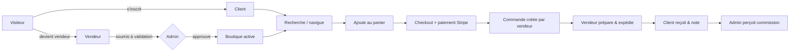
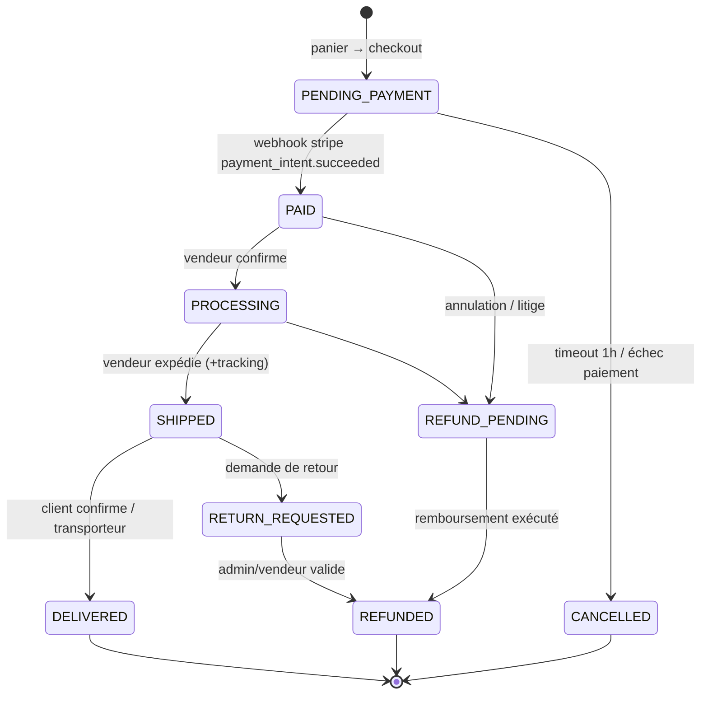

# 03 — Parcours utilisateurs (User Flows)

## 1. Flow global (vue d'ensemble)



## 2. Parcours CLIENT — « de la découverte à l'avis »

1. **Découverte** : landing → recherche (« robe été ») ou catégorie → résultats (filtres prix/boutique/note).
2. **Fiche produit** : galerie photos, variantes, stock, livraison estimée, profil vendeur, avis.
3. **Panier** : ajout quantité ; le panier regroupe des items de plusieurs boutiques → **sous-total par vendeur**.
4. **Checkout** :
   - connecté ? sinon inscription rapide / OAuth ;
   - adresse de livraison + méthode d'expédition ;
   - récapitulatif (une commande *logique* = N sous-commandes vendeurs) ;
   - paiement Stripe Payment Element (3DS géré).
5. **Post-achat** : email de confirmation → page « mes commandes » avec statuts par vendeur → notification d'expédition + numéro de suivi → après réception, invitation à laisser un **avis** (note 1-5 + texte + photos).
6. **Exceptions** :
   - échec paiement → relance panier ;
   - article en rupture pendant préparation → vendeur annule la sous-commande → remboursement automatique de la ligne ;
   - litige → demande de retour → escalade admin si vendeur silencieux > 72 h.

**Happy path KPI** : temps inscription→achat < 8 min ; conversion checkout > 2 %.

## 3. Parcours VENDEUR — « de l'inscription au payout »

1. **Onboarding** (goal : 1re mise en vente < 24 h) :
   - inscription (email/OAuth) → création boutique (nom, slug, logo) ;
   - choix du plan (Free par défaut) → abonnement Stripe si payant ;
   - **onboarding Stripe Connect** (compte connecté, payouts sur son IBAN) ;
   - soumission → statut `pending` en attente de validation admin.
2. **Catalogue** : ajout produit (titre, catégorie, prix, stock, ≥1 photo) → statut `draft` puis `active` ; upload multiple images ; variantes.
3. **Vente** : notification email/in-app d'une nouvelle sous-commande → bouton « Confirmer » → génère bordereau → saisit transporteur + tracking → « Expédiée ».
4. **Argent** : Stripe crédite le compte connecté du net (prix − commission plateforme) selon le calendrier de payouts ; dashboard vendeur : CA, commissions, prévision de payout.
5. **Après-vente** : gère demandes de retour, remboursements partiels/totaux.
6. **Exceptions** :
   - plan expiré → boutique suspendue (produits non visibles), réactivation après paiement ;
   - dépassement quota produits du plan → blocage création + proposition upgrade ;
   - compte Stripe non terminé → payouts bloqués + bandeau d'alerte.

## 4. Parcours ADMIN — « gouvernance de la place de marché »

1. **Dashboard quotidien** : GMV du jour, MRR, nouvelles demandes vendeur, files de modération, litiges ouverts.
2. **Validation vendeur** : dossier (identité, Rib/IBAN, description activité) → approuver / demander complément / rejeter (motif obligatoire, email auto).
3. **Modération produits** : file d'attente (nouveaux produits signalés + détection mots-clés interdits) → valider/retenir/retraiter ; bannissement contrefaçon.
4. **Référentiel** : catégories (arbre 2 niveaux), attributes, plans & tarifs, taux de commission.
5. **Litiges** : vue commande complète (qui a dit quoi) → arbitrage : remboursement forcé, avoir, sanction vendeur.
6. **Finance** : reconciliation Stripe ↔ DB (webhooks manquants), rapports commissions, export comptable CSV.

## 5. Machine à états — Commande (sous-commande par vendeur)



Règles :
- Décrément stock à `PAID` (réservation 1 h à `PENDING_PAYMENT`).
- Incrément stock à `CANCELLED`/`REFUNDED` (sauf retour refusé).
- Commission acquise à la plateforme uniquement à l'état `PAID` (et remboursée proportionnellement en cas de remboursement).

## 6. Machine à états — Boutique vendeur

```
draft → pending_validation → active ⇄ suspended → closed
                ↘ rejected
```
- `active` requis pour que les produits apparaissent côté client.
- `suspended` : plan expiré, litiges excessifs, décision admin.
