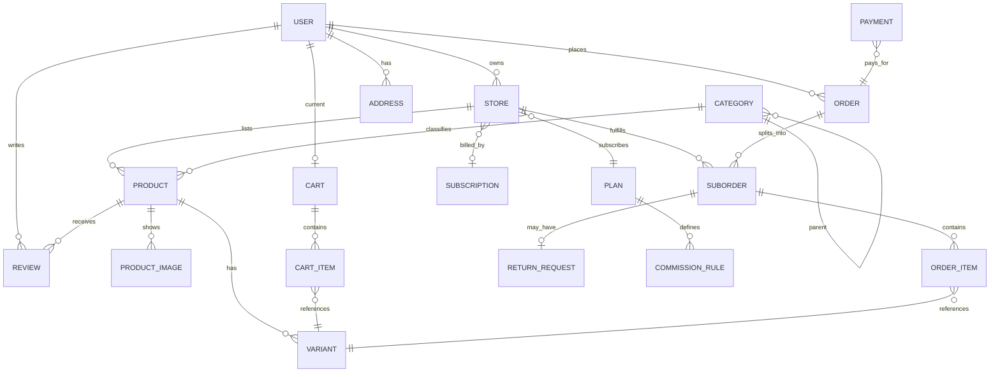

# 04 — Modèle de données (MCD / schéma conceptuel)

## 1. Entités principales & relations

## 2. Dictionnaire de données (tables clés)

### user
| champ | type | notes |
|---|---|---|
| id | uuid PK | |
| email | citext unique | |
| password_hash | text nullable | null si OAuth seul |
| full_name | text | |
| roles | text[] | `{client}`, `{vendor}`, `{admin}` — cumulables |
| status | enum | active, blocked, deleted |
| stripe_customer_id | text nullable | pour abonnements/checkout |
| created_at / updated_at | timestamptz | |

### store (boutique vendeur)
| champ | type | notes |
|---|---|---|
| id | uuid PK | |
| owner_id | FK user | 1 boutique par vendeur (V1) |
| name, slug (unique), logo_url, banner_url, description | | vitrine publique |
| status | enum | draft, pending_validation, active, suspended, rejected, closed |
| plan_id | FK plan | |
| stripe_account_id | text | compte connecté Stripe |
| commission_override | numeric nullable | dérogation décidée admin |
| rating_avg, sales_count | numeric | champs dénormalisés (perf) |

### plan (abonnement SaaS)
| champ | type | notes |
|---|---|---|
| id, name, code | | free / pro / business |
| price_monthly, price_yearly | numeric(10,2) | |
| max_products, max_orders_month | int | quotas (−1 = illimité) |
| commission_rate | numeric(5,4) | ex. 0.0500 = 5 % |
| stripe_price_ids | jsonb | {monthly, yearly} |
| features | jsonb | matrice de fonctionnalités |
| is_active | bool | |

### subscription (lien Stripe Billing ↔ store)
`id, store_id, plan_id, stripe_subscription_id, status(trialing/active/past_due/canceled), current_period_end, cancel_at_period_end`

### category
`id, name, slug unique, parent_id FK self, image_url, sort_order, is_active` — arbre géré par parent_id (profondeur ≤ 2 en V1).

### product
| champ | type | notes |
|---|---|---|
| id, store_id FK, category_id FK | | |
| title, slug, description | | slug unique global ou par boutique |
| status | enum | draft, active, paused, removed (modération) |
| moderation_status | enum | pending, approved, flagged, rejected |
| base_price, compare_at_price | numeric(10,2) | prix affiché / prix barré |
| currency | char(3) | EUR en V1 |
| sku, tags[], weight_g | | |
| rating_avg, review_count, sales_count | | dénormalisés |
| created_at… | | index sur (status, category_id), trigram sur title |

### variant
`id, product_id FK, sku, title (ex: "XL / Rouge"), options jsonb {size:"XL",color:"Rouge"}, price_delta numeric, stock int, low_stock_threshold, is_active`
→ `stock` porté par la variante (ou produit si sans variante : variante implicite `default`).

### product_image
`id, product_id, url, alt, sort_order, is_primary`

### cart / cart_item
- `cart`: `id, user_id (nullable → panier anonyme via cookie token), expires_at`
- `cart_item`: `id, cart_id, variant_id, quantity, added_at` — unicité (cart_id, variant_id).
- Prix recalculés serveur au checkout ; le client ne fournit que `variant_id + quantity`.

### order (commande logique côté client)
| champ | notes |
|---|---|
| id, number (ex: CMD-2026-000123), buyer_id FK | |
| status | enum global agrégé (voir doc 03) |
| shipping_address jsonb (snapshot figé à la commande) | |
| subtotal, shipping_total, discount_total, total, currency | snapshots prix |
| payment_id FK | |
| placed_at | |

### suborder (par vendeur — unité opérationnelle)
`id, order_id, store_id, status, subtotal, shipping_fee, commission_rate_applied, commission_amount, carrier, tracking_number, shipped_at, delivered_at, cancelled_reason`

### order_item
`id, suborder_id, variant_id, product_title_snapshot, variant_title_snapshot, unit_price_snapshot, quantity, refund_status(none/partial/full)`
→ **snapshots obligatoires** : l'historique ne doit pas changer si le vendeur modifie son produit.

### payment
`id, order_id, stripe_payment_intent_id unique, amount, currency, status (requires_action/succeeded/failed/refunded), paid_at, failure_message`

### refund / return_request
- `return_request`: `id, suborder_id, order_item_id, buyer_id, reason, status(pending, approved, rejected, completed), admin_notes`
- `refund`: `id, payment_id, suborder_id, amount, stripe_refund_id, status, created_by(user/vendor/admin)`

### review
`id, product_id, buyer_id, suborder_id (prouve l'achat), rating int 1..5, title, body, images[], status(published/pending/hidden), created_at` — unicité (product_id, buyer_id) ou (variante commandée).

### commission_ledger (registre financier plateforme)
`id, suborder_id, store_id, rate, gross_amount, fee_amount, net_amount, event_type(sale/refund_reversal), stripe_balance_transaction_id, recorded_at`
→ base des rapports admin et de la facturation.

### support_ticket, audit_log, notification, webhook_event (Stripe, idempotence)
- `webhook_event`: `stripe_event_id unique, type, payload jsonb, processed_at, status` — garantit le traitement idempotent.
- `audit_log`: `id, actor_id, action, entity_type, entity_id, before/after jsonb, ip, at`.

## 3. Règles d'intégrité & décisions de modélisation
1. **Snapshot des prix/titres** dans `order_item` (jamais de jointure live pour l'historique).
2. **Stock** : colonne `stock` sur variant + `reserved_stock` (optionnel V2) ; mise à jour atomique (`UPDATE ... WHERE stock >= n`) pour éviter ventes négatives.
3. **Slug boutique/produit** uniques → URLs SEO `/s/{store-slug}/p/{product-slug}`.
4. **Multi-devises** prévu mais verrouillé EUR en V1 (champs `currency` présents).
5. **Soft delete** produits/boutiques (`status`, `deleted_at`) pour préserver l'historique commandes.
6. Un utilisateur peut avoir `roles = ['client','vendor']` → mêmes credentials, deux espaces.

## 4. Index principaux (performance)
- `product(status, category_id)`, GIN `tags`, trigram `title` (pg_trgm) pour recherche.
- `suborder(store_id, status, created_at desc)` — file de travail vendeur.
- `order(buyer_id, placed_at desc)` ; `order_item(suborder_id)`.
- `commission_ledger(store_id, recorded_at)`, `(recorded_at)` pour GMV journalier.
- `review(product_id, status, created_at desc)`.
