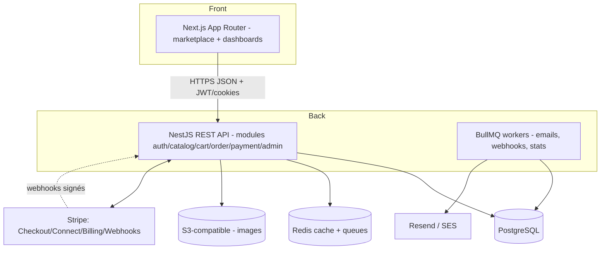

# 05 — Architecture technique & stack

## 1. Vue d'ensemble

**Choix directeur : monolithe modulaire + SSR, pensé pour être découpé plus tard si besoin.** À < 10 k commandes/mois, les microservices seraient un luxe coûteux.



## 2. Stack recommandée (et alternatives)

| Couche | Choix V1 | Alternative | Justification |
|---|---|---|---|
| Frontend | **Next.js 14+ (TypeScript, Tailwind, shadcn/ui)** | React SPA + API | SSR = SEO des fiches produits/boutiques indispensable |
| Backend | **NestJS (Node/TS)** | Laravel, Django, Rails | TS partagé front/back, structure modulaire propre, écosystème Stripe solide |
| ORM/DB | **PostgreSQL 16 + Prisma** | MySQL/Supabase | transactions fortes (stock/paiement), jsonb, full-text natif |
| Auth | **JWT (access 15 min + refresh rotatif en cookie)** via Nest Guards ; OAuth Google | Lucia/Auth.js/Clerk | contrôle total des rôles cumulables client/vendor/admin |
| Paiement | **Stripe Connect (Standard accounts) + Payment Element + Billing** | PayPal en V2 | répartition multi-vendeurs + commissions natives |
| Files/queue | **Redis + BullMQ** | SQS | emails, webhooks, agrégats stats en asynchrone |
| Stockage médias | **S3/Cloudflare R2 + CDN (Cloudflare)** | | images produits, uploads vendeurs |
| Recherche | Postgres FTS + pg_trgm | Meilisearch (V2) | suffisant MVP, zéro infra supplémentaire |
| Observabilité | Sentry + logs structurés (Pino) + Grafana Cloud | | traçage erreurs checkout critique |
| Déploiement | Docker Compose → Railway/Fly.io ou VPS + Coolify | AWS ECS | simplicité ops au démarrage |
| CI/CD | GitHub Actions : lint, tests, migrations Prisma, preview | | |

## 3. Découpage backend (modules NestJS)

```
src/
├── auth/            # inscription, login, OAuth, refresh, guards & roles
├── users/           # profils, adresses
├── stores/          # boutiques, onboarding vendeur, validation admin
├── plans/           # abonnements SaaS + Stripe Billing
├── catalog/         # catégories, produits, variantes, images, stock
├── search/          # recherche & filtres catalogue public
├── cart/            # panier anonyme/authentifié, fusion
├── orders/          # commande, sous-commandes, machine à états, retours
├── payments/        # PaymentIntents, webhooks Stripe, remboursements, ledger commissions
├── reviews/         # avis (liens vérifiés achat)
├── notifications/   # templates emails + in-app
├── admin/           # modération, KYC, reporting, audit log
└── common/          # pagination, interceptors, idempotency, rate-limit
```

## 4. Points d'architecture critiques

### 4.1 Paiement multi-vendeurs (le cœur du modèle)
- Au checkout : **1 PaymentIntent** avec `transfer_data.destination` impossible pour multi-destinations → on utilise plutôt :
  - **Option retenue (recommended)** : paiement sur le compte plateforme puis **transferts séparés par sous-commande** via `Transfer`/`Separate Charges and Transfers`, OU Stripe Connect avec **Direct Charges** par sous-commande groupées dans un Checkout Session multi-line-items (`application_fee_amount` par ligne).
  - ⚠️ À trancher en spike technique S1 (voir doc 08) — c'est LE risque technique n°1.
- Webhooks traités de façon **idempotente** (table `webhook_event`, clé = event.id).
- Réconciliation quotidienne job cron : `payment.status` ↔ commandes `PENDING_PAYMENT`.

### 4.2 Cohérence du stock
- Réservation au checkout (transaction + `UPDATE variant SET stock = stock - $q WHERE stock >= $q RETURNING`), libération après timeout 1 h (BullMQ delayed job).

### 4.3 Sécurité
- Validation stricte côté serveur (class-validator/Zod) ; jamais de prix fourni par le client.
- RBAC : guards par rôle + ownership checks (`store_id` du token vs ressource).
- Rate limiting (login, checkout, upload), CSP, cookies `httpOnly/secure/sameSite`.
- Secrets via variables d'env ; PCI délégué à Stripe (aucune donnée carte en base).

### 4.4 Multi-tenancy & isolation
- Toutes les tables métier portent `store_id` ; middlewares qui injectent le périmètre du vendeur ; politiques testées en intégration.

## 5. Environnements
`local (docker compose)` → `preview (PR deploys)` → `staging` → `production`. Seeds de données + comptes Stripe test.

## 6. Estimation de charge MVP (dimensionnement)
- 1 app server 2 vCPU/4 GB, Postgres 2 vCPU/8 GB (+ PGBouncer), Redis 1 GB, bucket objets. ≈ 60–120 €/mois d'infra hors Stripe/Sentry.
